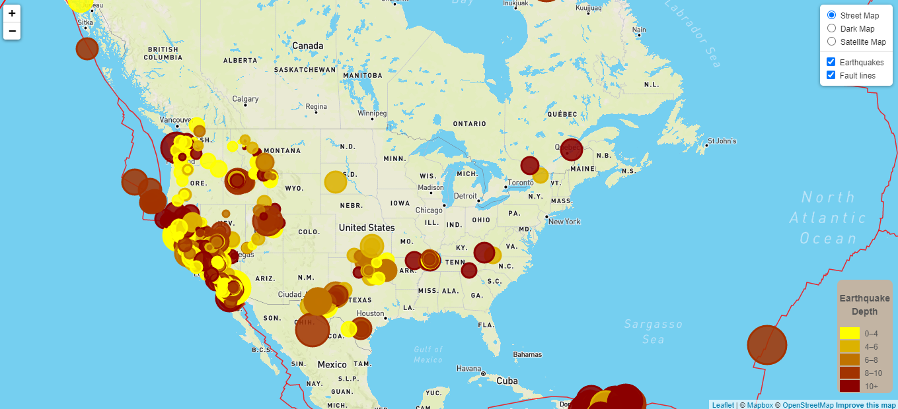
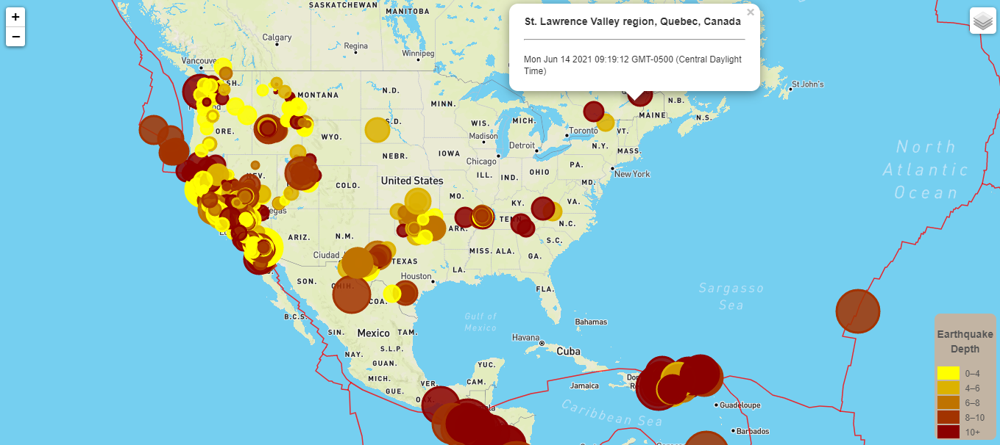
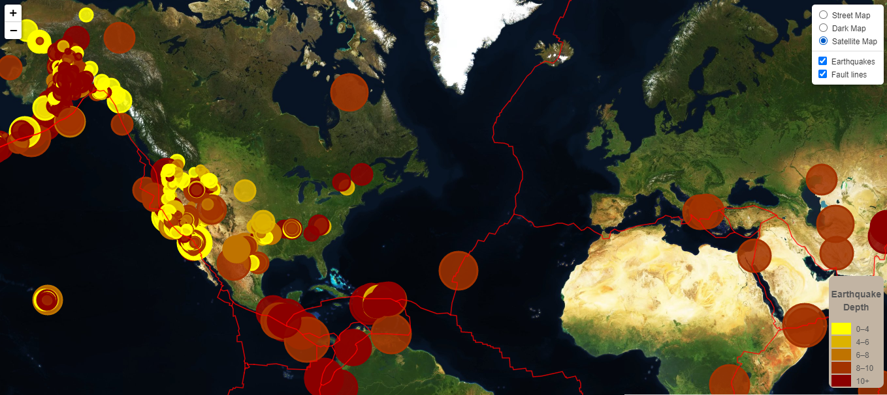

# Leaflet Project - Visualizing Data with Leaflet

## Background

Welcome to the United States Geological Survey, or USGS for short! The USGS is responsible for providing scientific data about natural hazards, the health of our ecosystems and environment; and the impacts of climate and land-use change. Their scientists develop new methods and tools to supply timely, relevant, and useful information about the Earth and its processes. As a new hire, you will be helping them out with an exciting new project!

The USGS is interested in building a new set of tools that will allow them visualize their earthquake data. They collect a massive amount of data from all over the world each day, but they lack a meaningful way of displaying it. Their hope is that being able to visualize their data will allow them to better educate the public and other government organizations (and hopefully secure more funding..) on issues facing our planet.

## Your Task

### Level 1: Map Visualization showing all earthquakes in the past 7 days and the tectonic plates 

Your first task is to visualize an earthquake data set.

1. **Get the data set**

   

   The USGS provides earthquake data in a number of different formats, updated every 5 minutes. From the [USGS GeoJSON Feed](http://earthquake.usgs.gov/earthquakes/feed/v1.0/geojson.php) page the URL for 'All Earthquakes from the Past 7 Days' was picked and a JSON representation of that data was loaded for the visualization.

2. **Import & Visualize the Data**

   Create a map using Leaflet that plots all of the earthquakes from your data set based on their longitude and latitude.

   * Data markers are reflecting the magnitude of the earthquake by their size and and depth of the earth quake by color. Earthquakes with higher magnitudes appear larger and earthquakes with greater depth appear in darker in color.

   * When a marker is clicked a popup provides additional information about the earthquake - location and date

   * The legend provides context for different earthquake depth.
  
- - -

### Level 2: More Data

The USGS wants you to plot a second data set on your map to illustrate the relationship between tectonic plates and seismic activity on a satellite map. 

- - -
